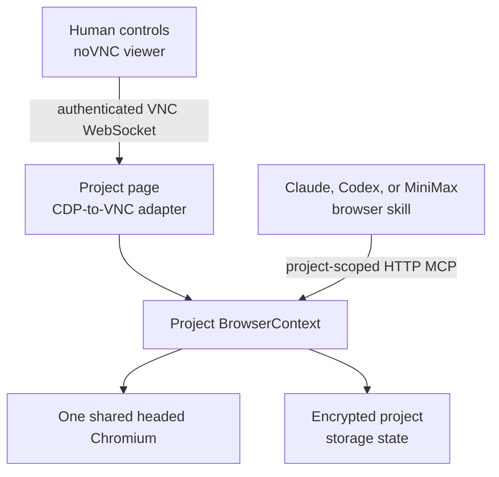
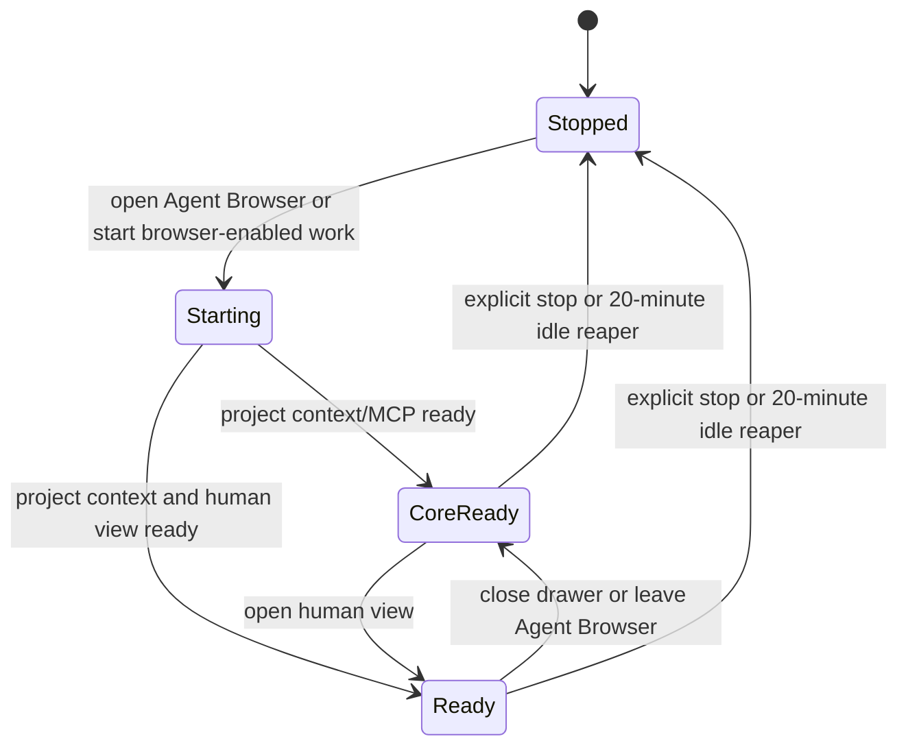

# Agent Browser

Agent Browser is one isolated browser session shared by a person and an agent
inside a project. Active projects use separate BrowserContexts inside one
host-level headed Chromium, avoiding a full Chrome/Xvfb/noVNC stack for every
workspace. Use it when work depends on a real website, visual login, consent,
or another step that cannot be completed through the local app preview.

## Before you begin

- Use a project chat. Agent Browser is scoped to a project, not to one chat.
- For agent control, choose Claude, Codex, or MiniMax and add the `browser`
  skill before sending the prompt. Kimi and Antigravity do not currently
  receive equivalent Browser MCP access.
- Decide whether the selected agent may access the sites and account data in
  this browser profile. Login state is deliberately shared and persistent.
- Follow the target site's terms. Human intervention is not permission to
  bypass an access-control challenge.

## Sign in once, then let the agent work

1. Open the project chat and select **Open Browser**.
2. Select **Agent browser — log into a site and let the agent drive it**.
3. Wait for the drawer title to change to **Agent browser** and for **Live
   login session · connected**. During startup it can read **starting…** or
   **core ready**.
4. In the live browser, navigate to the site and complete the permitted login,
   consent, or account-selection steps.
5. In the chat, select Claude, Codex, or MiniMax, add the `browser` skill, and
   send a precise browser task.
6. Watch the same window. Take over with the mouse and keyboard whenever the
   site needs a human decision, then tell the agent to continue.
7. When finished, either select **Close browser** to leave the agent-facing
   browser core available, or select **Stop the agent browser** to stop the
   complete stack.

**Outcome:** the human live pane and the agent's MCP tools operate the same
project tabs and isolated storage. A login completed by the human is therefore
immediately available to the browser-enabled agent, but not to another project.

## Shared-session architecture

There is one Agent Browser session per project, not one per user, chat, or
agent run. Its viewport is fixed at **1280×720**. Human and agent input can
collide, so pause one side before the other types or clicks. Different projects
can be logged into different accounts on the same site at the same time.

The human pane uses noVNC for rendering, pointer input, and keyboard handling.
The broker translates only that project's page frames and input into VNC; it
does not expose the host desktop. The viewport scales to fit the pane. The
**Keyboard** button opens a mobile keyboard. Use **Copy** for selected page text
and **Paste** for clipboard text, including Unicode; a manual text panel is
available when the local browser denies clipboard permission. Password-field
contents cannot be copied through the selection control. Remote clipboard
shortcuts never read the host clipboard shared by Chromium windows.

The display and toolbar reconnect together after a dropped connection, with
retries between 400 milliseconds and five seconds. A temporary disconnect
preserves the running project context; input entered while disconnected is not
queued or replayed. If a browser context is stopped, its saved login state is
retained but its tabs and unsaved page contents are not.

## Start, close, and stop mean different things

| Action | Human view | Agent-facing project context | Login data |
| --- | --- | --- | --- |
| Select Agent Browser | Starts or reconnects | Starts if needed | Reused |
| Select **Close browser** | Stops | Keeps running | Kept |
| Toggle back to app preview | Stops | Keeps running | Kept |
| Select **Stop the agent browser** | Stops | Context closes | Saved encrypted on the host |
| Replace the project container | Stops | Context can stay available | Kept in encrypted host storage |

Closing the pane is therefore not a full browser stop. Use **Stop the agent
browser** when the project should no longer have an active context. Chromium
itself exits only after the final project context is gone and its short process
idle timer expires. Stopping does not sign out of websites or delete saved login
state.

## Idle reaping

The backend checks browser activity every minute. It stops the complete stack
after **20 minutes** without pane or browser-enabled agent activity.

An attached live-view WebSocket counts as an active viewer. Close or leave the pane
if you expect the idle reaper to reclaim the browser. A browser-enabled agent
run also sends activity heartbeats while it is using the session.

## Security and operating boundaries

- Every authorized actor and browser-enabled agent working in the project
  reaches the same profile and window.
- Encrypted storage state survives normal container replacement, so cookies,
  local storage, and IndexedDB sessions can outlive one Chromium process.
- Each context has normal public internet access. Private, link-local, cloud
  metadata, and sibling `.lxd` targets are blocked; only its own `.lxd` name is
  allowed on the project bridge.
- There is no per-task browser profile, per-chat session, or incognito
  boundary.
- The live screencast exposes what is in the project's active tab. The agent
  can read and operate all tabs in that same project context through MCP.
- The noVNC virtual screen streams web-page content, not Chromium's native window chrome.
  Browser permission bubbles, certificate dialogs, and other browser-owned UI
  are not available in the human view; browser file selection is also disabled.
  Right-click native menus and middle-click primary-selection paste are
  disabled; use the viewer's scoped Copy and Paste controls instead.
- BrowserContext isolation separates normal web identity and storage, but it is
  not a VM/process security boundary. Projects facing mutually hostile browser
  code still require separate browser processes or servers.
- Stop semantics preserve storage state. Sign out on the website or clear its
  data when persistence is not desired.
- Legacy per-container Chrome profiles are kept for rollback but are not
  imported automatically; sign in once when a project first uses the pooled
  browser.
- Some sites block automation. Do not defeat CAPTCHA, anti-bot, consent, or
  authorization controls that the site requires.

Treat the profile like a project credential store: only sign in to accounts
whose scope is appropriate for every trusted agent and project collaborator.

## Related documentation

- [Previews and browser architecture](../03-platform/06-previews-and-browser.md)
- [Previews and element inspector](06-previews-and-inspector.md)
- [Chat and agent controls](03-chat-and-agent-controls.md)
- [Threat model](../threat-model.md)
- [Known limitations](../known-limitations.md)
